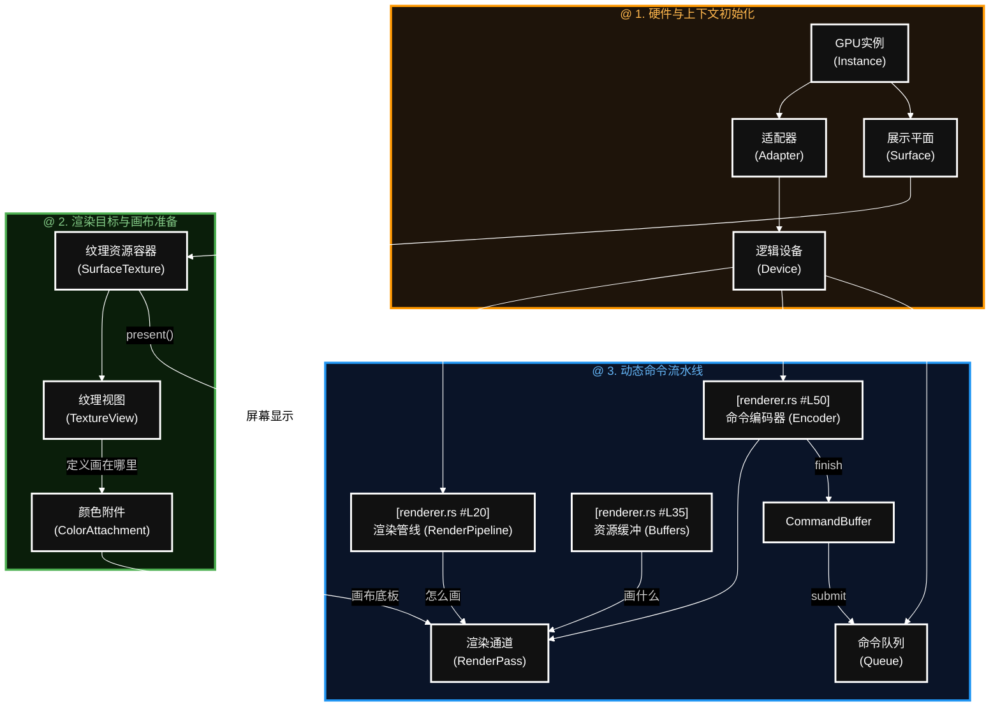

# 1. joy and skog game learn

## 1.1 依赖关键字梳理

- use std::sync::Arc;  标准库原子引用
- winit 跨平台窗口管理与事件循环
- wgpu 基于WebGPU标准的现代图形API库
- gilrs 游戏手柄输入库
- platform 针对特定平台的时间库

- crate::core::core 引擎的核心上下文或启动入口
- crate::scene::SceneStack 场景栈,用来管理游戏状态切换
- crate::scene::{Layer, Scene, SceneAction, SceneResources}: 具体场景定义，涂层管理，场景间传递的动作和资源

- crate::assets::AssetManager, Assets: 全局资产管理器，从磁盘或网络加载资源
- crate::assets::audio::SoundId: 音频资源的唯一标识符
- crate::textures::{Atlas, AtlasId, TextureResorceId}: 纹理集，多张小图合并成一张大图以优化渲染性能
- crate::materials::MaterialId: 材质Id(决定为物体表面如何与光照和着色器交互)
- crate::store::{Map, Set, PushList, SecondaryMap, Slab, Sparse} 引擎自定义的高性能底层数据结构

## 1.2 GPU渲染

