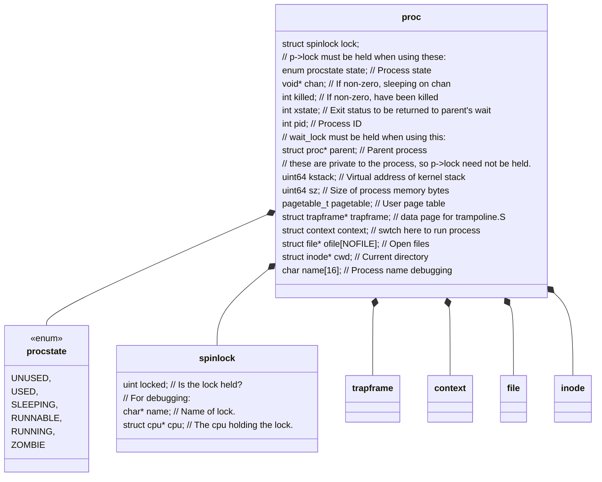
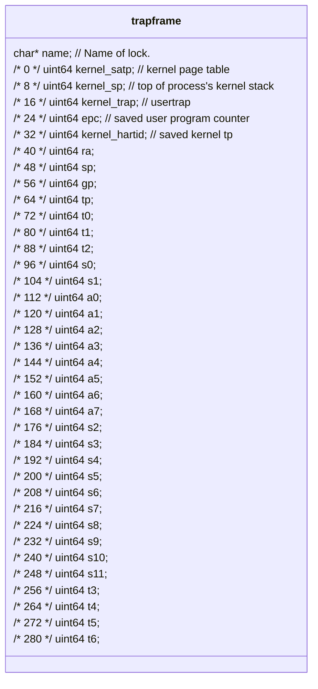
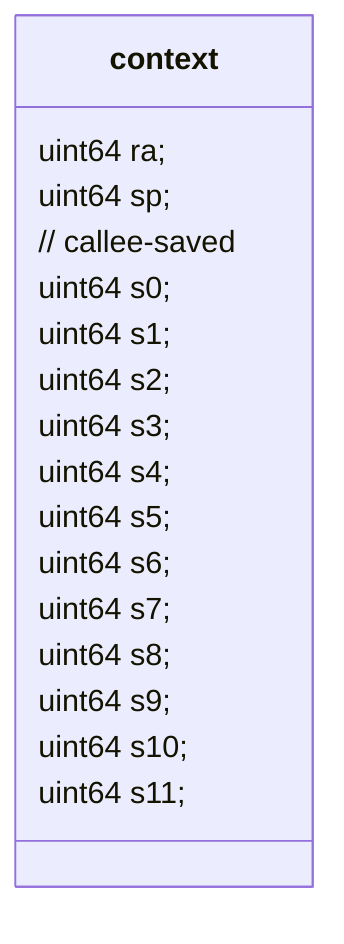
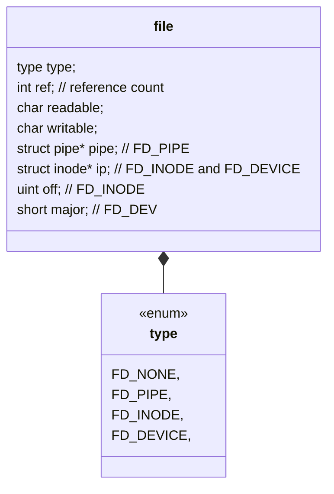
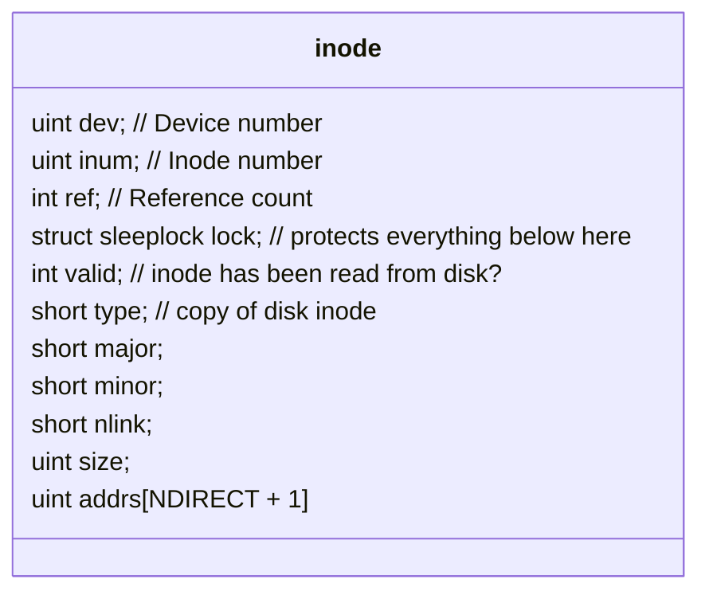

# xv6

## 1 快速运行，魔改xv6 

### 1.1 快速运行
```bash
# 下载xv6
git clone https://github.com/rtenlab/xv6-riscv
cd xv6-riscv

# 编译和运行xv6
make qemu

# 退出
ctrl + A, X
```

### 1.2 添加一个系统调用

#### 1.2.1 target
    
创建一个sys_hello的系统调用，功能在屏幕上打印消息: Hello from kernel n 

#### 1.2.2 add code

kernel/syscall.h
```c
#define SYS_hello 22 // hello
```

kernel/syscall.c
```c
[SYS_hello] sys_hello, // hello: syscall entry
```

kernel/sysproc.c
```c
uint64 sys_hello(void) {
    int n;
    argint(0, &n);
    print_hello(n);
    return 0;
}
```

kernel/proc.c
```c
void print_hello(int n) {
    printf("Hello from kernel space: %d\n", n);
}
```

kernel/defs.h
```c
void print_hello(int);
```

user/usys.pl
```c
int hello(int);
```


[new] user/test.c
```c
#include "kernel/types.h"
#include "kernel/stat.h"
#include "user/user.h"

int main(int argc, char *argv[]) {
  int n = 0;
  if (argc >= 2) n = atoi(argv[1]);
  printf("Say hello to kernel %d\n", n);
  hello(n);
  exit(0);
}
```

Makefile 
```Makefile
UPROGS=\
    $U/_wc\
    $U/_test\ # 把自己的程序加入进去
```

编译运行
```bash
make qemu
test
```

### 1.3 gdb调试

```bash
# 启动调试环境
make qemu-gdb

# 新打开一个窗口，启动gdb调试
gdb-multiarch

# 加载符号表
file kernel/kernel

# 连接
target remote :26000

# 调试
b main
c
```

## 2 核心数据结构梳理

### 2.1 进程结构


[查看trapframe类图](#trapframe) |
[查看context类图](#context) |
[查看file类图](#file) |
[查看inode类图](#inode)

<a id="trapframe"></a>


<a id="context"></a>


<a id="file"></a>

[查看inode类图](#inode)

<a id="inode"></a>


## 课题探索

1. https://pdos.csail.mit.edu/6.1810/2025/readings/meltdown.pdf
2. https://docs.kernel.org/

a. 如果一个进程用 malloc 申请了 1GB 的虚拟内存，但在代码里一次都没有读写过它，操作系统会真的在物理内存（RAM）里给它分配 1GB 的空间吗？ 为什么？ 
```text
在这个过程中，操作系统和 MMU 玩了什么把戏？ 
    LazyAllocation
如果之后进程突然去写这块内存的第一个字节，硬件和内核里会依次发生什么？ 
    page fault -> trap handler -> vma -> 物理内存分配器 -> edit page table -> trap restore
如果之后进程突然去读这块A存的第一个字节, 然后写，硬件和内核里会依次发生什么？ 
    page fault -> trap handler -> Global Zero Page -> edit page table (Readonly) -> trap restore
    page fault -> trap handler -> copy new physical page -> edit page table (rw) -> trap restore
```

b. 2018 年震惊全球的 Meltdown（熔断） CPU 漏洞，是如何利用 Intel 处理器在“执行指令”与“权限检查”之间的时间差（乱序执行机制），实现在用户态读取只有内核态才能访问的虚拟地址空间数据的？
```text
Out-of-Order Execution 允许访问非法地址在权限校验之前执行 -> 随后判断无权限,回滚数据,但是cpu cache里留痕了 -> 程序退出
通过(Flush + Reload)技术把残留在Cache里的痕迹捞出来

PS:
    Meltdown利用的地址是 合法内核空间地址, User/Supervisor = 0, 用户无法访问
    用户态多级页表: PGD(页全局目录) -> PUD(页上级目录) -> PMD(页中间目录) -> PTE(页表项)
```

c. 为了彻底堵死这个漏洞，现代 Linux 内核被迫引入了 KPTI（内核页表隔离） 技术。请问 KPTI 是如何粗暴地改变进程的虚拟地址空间的？它付出了怎样惨痛的性能代价？
```text

PS:
    cpu_entry_area: 用户态也必须用到的(跳板区)Trampoline,包含 TSS(任务状态段), GDT(全局描述符表), IDT(终端向量表)
    2MB对齐: 
        利用HugePage机制, 在PMD(页目录项)这一级，如果某ps位为1, 直接返回，不查PTE
        收益:
            浪费2MB RAM 利用HugePage机制, 换取KPTI开启后系统在内核切换页表时，可以"只该一个PMD寄存器项"的极高效率快速运行
```

## xv6

### 第一节
```bash
课程目标: 
    - design: 设计是一种高层次的结构
    - implementation: 代码的具体实现

OS的目标:
    - ABSTRACT H/W
    - MULTIPLEX
    - ISOLATION
    - SHARING
    - SECURITY, PERMISSION, ACESS CONTROL
    - PERFORMANCE
    - RANGE OF OSES

设计理念,组织方式:
    OS的结构
        --USER------------------
        VIM CC SH    (IPC)
        --KERNEL----------------
        关注点: 内核中发生的所有事情,与应用程序的接口,内核,内核内部软件的结构
        service: FS, process(cpu, 独立mem), MEM(alloc), IPC, DRIVER
        5 million line code.
        --HW--------------------
             CPU RAM DISK NET

    操作系统提供的接口: (以系统调用的机制进行调用)
        fd = open("out", +)
        write(fd, "hello\n", 5)
        pid = fork()

    OS的挑战与有趣:
        - 环境非常严苛,编写操作系统需要用到qemu模拟硬件去运行,用户需要使用它来运行他们的程序
        - tensions
            EFFICIENT -     ABSTRACT
            POWERFUL  -     SIMPLE API
            FLEXIBLE  -     SECURE
         做好的是可能的，但是需要技巧

议题清单:
1. 客观情况:示例中代码没有检查系统调用的返回,这很有可能写出可以正常通过编译,但无法得到正确结果的程序; 需要程序员格外小心,检查参数,返回值信息是否有错误?
2. 字节流是什么意思? 如果一个文件包含大量的字节,每次操作系统处理100个字节,就需要连续处理很多次,形成流式处理.   
3. 不同进程中的文件描述符可能相等吗,内核怎么帮你处理这种情况?
    文件描述符是在内核的一个小表中进行索引,内核会为每个运行的进程独立维护一个文件描述符文件,该表表示每个文件描述符对应的内容
4. 编译器如何处理系统调用?编译器是否会生成并调用操作系统代码段?
    当c语言代码调用open,write,exit等系统调用时,有一种特殊的RISCV指令(ecall)可调用它将控制权转移到内核。(open,write,exit)属于c库函数(abi),库函数使用汇编实现的,其中包含前面说到的特殊riscv指令. 内核会查看进程的内存,并检查寄存器,以确定参数内容.
5. shell中执行命令echo时，我们希望echo执行完成后还可以返回到shell中来，所以shell中的机制是fork出子进程然后子进程调用exec?
6. fork-then-exec, 因为fork后的进程会完全复制出一个子进程来，exec又会替换这个子进程会不会有资源的浪费? fork进程中的内存没有使用,又被全部替换.
7. 父进程的输出没有与子进程交叉, 原因是exec调用背后有复杂操作, 在exec执行时开销较大，load文件到memory, 分配完内存后以及释放旧进程的内存后,耗时较长
8. 子进程不能等待父进程吗? 是的
9. 如果一个程序fork出多个子进程,只要一个子进程返回,wait就不会继续等待, 可以根据wait返回的id区分具体哪个子进程返回.
10. shell当中重定向怎么实现的? echo hello > out; cat < out;  fork出一个子进程,在子进程中更改文件描述符,关闭stdout 1,打开一个文件out.txt,这个描述符从最小分配,所以子进程就实现了重定向stdout 1 到文件out.txt, 也不会影响父进程
```

### 第二节

```bash
目标:
    - ISOLATION
        shell, echo, find 这些程序的使用中,假如echo中的实现有一个bug,在运行echo时发生crash,我们这个时候不希望它影响到其他进程。
        应用程序可能是恶意的 = OS be defenced
        应用程序与操作系统强隔离, 应用程序进程之间隔离.
    - KERNEL/USER MODE
        强隔离需要借助和硬件协作完成
    - system call
    - xv6


假如我们没有操作系统: 
    shell, echo
    =================================
    CPU, MEM
    
    假如没有操作系统,通过引入lib库,直接访问cpu,内存编程;    这个时候希望shell,echo同时运行,没有操作系统的上下文切换,自己手动编写shell让出cpu资源，换echo上，如果shell中有bug,进入了无限循环, G了

    MEM:
        sh      1000
        echo    st1000,x
    假如没有操作系统,通过引入lib库,直接访问cpu,内存编程;    shell对内存操作时addr写错了, 不小心覆盖了一小部分echo的内存,会导致echo的各种问题

    这就是没有强隔离, 一个问题会渗透到多个进程中去,调试非常困难; 不需要操作系统，仅通过库的形式很少见，因为它需要应用程序的强信任.可能会在实时操作系统中见到 

Unix interface:
    - abstract the hw resource 在多路复用,物理内存方面, 接口抽象了硬件资源实现强隔离成为可能(尽管不太容易)
        process: instead of cpu; 时间分片,分时复用: a进程运行100毫秒,b进程100毫秒, 对cpu的利用划分时间片,分给多个进程使用  
        exec: instead of memory; 文件中存储的是程序的内存影像,文本和全局数据, 应用程序可以扩展内存,但是你不能直接访问物理内存 0x1000
        file: instead of disk block; 可以读取和写入操作文件;   操作系统来决定将文件映射到磁盘块中,控制用户A无法读写用户B的文件

KERNEL/USER MODE:
    USER: 非特权指令 (add sub jar)
    KERNEL: 特权指令 (操作硬件，设置保护机制，设置页表寄存器, 发送禁用时钟中断的指令)

```
### 第三节

```bash
page table:
    keyword: 隔离，进程看到虚拟地址, 物理地址, 映射 
    [address space, page hw, xv6 vmcode + layout]

Address space:
    进程拥有自己的地址空间; 虚拟地址可能大于物理地址空间,也可能小于物理地址空间.
    页面空间不足，页面是如何分配的，操作系统kalloc处理这个问题的，返回一个空指针。 操作系统会优雅地处理这些问题，优雅指的是想用户应用程序传递错误信息.

如何实现地址空间:
    使用page table, 这是有硬件支撑的, 有一个叫做mmu的地址转换硬件. mmu地址转换 虚拟地址->物理地址; 为每个应用程序提供自己的映射.  映射表是存储在内存中的，mmu不存储映射表，只能翻译  satp寄存器, 内核级指令可以读写satp寄存器

    64bit寄存器可以存储多少个地址:
        前提:
            page size=4096    
            64bit结构[ext 25, index 27, offset 12]

        推论:
            实际大小:  echo $((2**39/1024/1024/1024))
                512Gbyte

    虚拟内存: 2**27  
    物理内存: 2**56  硬件工程师根据趋势选择了56， 实际上可以扩展到64位

risc-v页表的实际实现:
    VM64bit结构[ext 25, index 27, offset 12]
        index 27: page directory=4096byte, PTE=8byte, 所以一个page directory有512条目
            L2 9: 索引顶级页目录，索引一个PTE, [Reserved 10 PPN 44 FLAGS 10]
            L1 9: 索引次级页目录 
            L0 9: 索引底层页目录
    SATP指向顶层的根目录，得到新的PPN(也就是下一级的页目录)，使用L1索引下一级的页目录，最终得到最后的页目录的页表项即为物理地址，完成了翻译过程。
    概念梳理:
        1. 物理地址最大是被设计成56位, 2**56=512G
        2. 页目录的大小是4096byte, 一个页表项,一页最大可以存储512PTE
        3. PTE结构 [Reserved 10 PPN 44 FLAGS 10]
            FLAGS 10:
                valid
                readable
                writable
                executable
                user
                global
                accessed
                dirty
                reserved for supervisor software
        4. SATP中必须存储的是物理地址, PPN必须是物理地址, 不能让一个解决方案依赖另一个解决方案
            satp[MODE 4, ASID 16, PPN 44]
                MODE: 0 bare模式， 8 开启Sv39模式
                ASID: 区分不同进程的TLB缓存
                PPN: 根页表的物理号
    结论获得:
        观点一: 因为硬件工程师定义了物理地址被设计为56位, 最大表示512G, 按照字节映射到字节，一个页表大小4096(2**12), 所以一个PPN 只需要44bit(56 - 12)即可
        观点二: 根据SATP寄存器中的值找到对应顶级页目录,然后根据地址中的L2 表示的9位找到对应的PTE, 取出其中的PPN, 用来加载下级页目录，然后依次类推，最终取出底层的PPN 和 SATP中的OFFSET(12位)拼接到一块即可完成翻译动作(从虚拟地址空间到物理地址的映射)
        观点三: 索引分三步完成，不是一步完成，主要优势是虚拟空间没有用到的就不创建PTE

TLB(Transilation lookaside buffer): 地址转换旁路缓冲器, 超高速硬件缓存, CPU为了不让虚拟内存机制拖慢速度"内存地址翻译加速缓存"

page table 提供了一种间接性, 虚拟地址->物理地址完全有操作系统操控。
    机制一: 当页表项无效时，硬件会触发页面错误; 操作系统会更新页表，重新执行指令.
    机制二: 内存中有一些页面位于高位，比如栈，内核栈位于高位，也被映射到内存高位, 位于高位的原因是下面有个防护页，PTE的有效位并未设置, 栈溢出的时候立即panic, 我们并不想浪费内存，我们通常将栈放在高位，+一个防护页实现; 虚拟地址可以是1.1 1.N N.1映射方式是可行的
```

